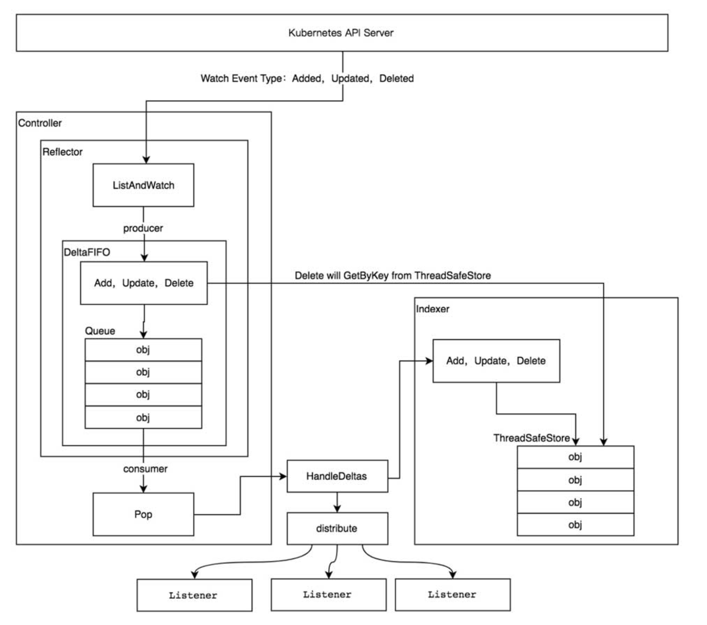
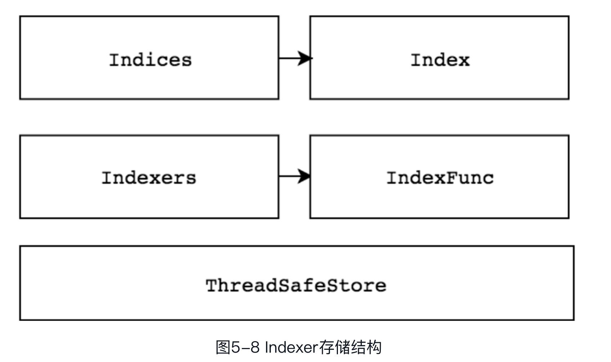

# informer机制
informar 的主要是为例保证消息的实时性、可靠性、顺序性等。

## 架构设计

> 图片摘自《kubernetes 源码剖析》

#### 资源informer
每一个 k8s 资源都实现了 informer 机制，每一个informer都会实现informer和Lister方法。例如PodInformer
```golang 
// verdor/k8s.io/client-go/informers/core/v1/pod.go
// PodInformer provides access to a shared informer and lister for Pods.
type PodInformer interface {
	Informer() cache.SharedIndexInformer
	Lister() v1.PodLister
}
```

####  shared informer 共享
informer 是可以被共享使用的，在用client-go编写代码时，若同一资源的informer被实例化多次，每个informer使用的一个Reflector，会有相同的ListAddWatch，太多重复的序列化和反序列化操作会导致api-server负载过重。所以同一资源类型的Informer共享一个Reflector，通过 map 数据结构实现数据共享。
```golang
// verdor/k8s.io/client-go/informers/factory.go
type sharedInformerFactory struct {
	client           kubernetes.Interface
	namespace        string
	tweakListOptions internalinterfaces.TweakListOptionsFunc
	lock             sync.Mutex
	defaultResync    time.Duration
	customResync     map[reflect.Type]time.Duration

	// 资源共享
	informers map[reflect.Type]cache.SharedIndexInformer
	// startedInformers is used for tracking which informers have been started.
	// This allows Start() to be called multiple times safely.
	startedInformers map[reflect.Type]bool
}
```

## Reflector
informer 可以对api-server的资源执行监控（watch）操作，资源类型可以是k8s的内置资源，也可以是CRD自定义资源，最核心的功能就是Reflector。Reflector 用来监控指定的k8s资源，当监控的资源发生变化时，触发相应的变更事件，例如Added（资源添加）事件、Updated（资源更新事件）事件、Deleted（资源删除事件），并将其资源对象存放到本地缓存 DeltaFIFO 中。
> 代码位置：verdor/k8s.io/client-go/tool/cache/reflect.go

根据示例代码中，最后执行到了 informer.Run()函数,进而追踪到 Reflector.ListAndWatch() , ListAndWatch 分为两部分
1. List 获取资源列表

    执行流程
    ```
    r.listerWatcher.List(options)
        获取资源下的所有对象数据
            获取的资源由options的 ResourceVersion 控制；
            如 ResourceVersion 为0，则获取全量的数据；
            非0，则按资源版本号获取。
               ▽
    listMetaInterface.GetResourceVersion()
        获取资源版本号
               ▽
    meta.ExtractList(list)
        将资源数据转化为资源对象列表
            将 runtime.Object对象转换成 []runtime.Object 对象;
               ▽
    r.syncWith(items, resourceVersion)
        将资源对象列表的资源对象和资源版本号存储（replace）到DeltaFIFO中，
        并替换已存在的对象。
               ▽
    r.setLastSyncResourceVersion(resourceVersion)
        设置最新的资源版本号
    ```

2. Watch 监控资源数据
   
    执行流程
    ```
    r.listerWatcher.Watch(options)
        监听资源更新情况
            通过clientSet与api-server建立长连接，
            接收资源变更事件。
                ▽
    r.watchHandler(w, &resourceVersion, resyncerrc, stopCh)
        将监听到的事件更新到 DeltaFIFO中，并更新ResourceVersion
    ```
   
## DeltaFIFO
- Delta 是一个资源对象存储，可以保存资源对象的操作类型，例如Added（添加）操作类型、Updated（更新）操作类型、Deleted（删除）操作类型、Sync（同步）操作类型等
- FIFO 是一个先进先出的队列，它拥有队列操作的基本方法，例如Add、Update、Delete、List、Pop、Close等
> 代码位置：vendor/k8s.io/client-go/tools/cache/delta_fifo.go
DeltaFIFO是一个生产者－消费者队列，其中应将Reflector用作生产者，而消费者则是调用Pop（）方法的对象。

1. 生产者
   
    生产者操作 Add()、Update()等 最终由 queueActionLocked()实现生产。
    ```golang
    // queueActionLocked追加到对象的增量列表中。
     //调用前必须先加锁。
    func (f *DeltaFIFO) queueActionLocked(actionType DeltaType, obj interface{})     error {
        // 生成object对应的key
    	id, err := f.KeyOf(obj)
    	if err != nil {
    		return KeyError{obj, err}
    	}
    	// 将新的时间追加的已有队列
    	newDeltas := append(f.items[id], Delta{actionType, obj})
    	// 进行去重操作（只针对最后两个事件执行）
    	newDeltas = dedupDeltas(newDeltas)
    
    	if len(newDeltas) > 0 {
    		if _, exists := f.items[id]; !exists {
    			f.queue = append(f.queue, id)
    		}
    		// 更新事件队列
    		f.items[id] = newDeltas
    		// 广播通知消费者解除阻塞
    		f.cond.Broadcast()
    	} else {
    		// 队列中没有事件，则将他移除
    		delete(f.items, id)
    	}
    	return nil
    }
    ```

2. 消费者
   
    消费者操作为Pop方法
    ```golang
    // pop 方法会阻塞至有元素进入队列，然后将它返回，
    // 如果队列中有多个元素，则按照他们添加或更新的顺序返回，
    // 元素在返回之前已经被移除了队列，如果process函数没有成功的处理它，
    // 则需要调用 AddIfNotPresent() 来把它添加回去。
    // process 函数是在取得锁之后执行的，所以它是安全的更新需要与队列同步的数据结构（例如    knownKeys）。
    // PopProcessFunc 可能返回带有嵌套错误的 ErrRequeue 实例，
    // 来表示当前元素应重新排队（等效于在锁下调用 AddIfNotPresent ）。
    // pop 返回一个Delta, 其中包含对象在队列中时发生的所有事件（增量）的完整列表。
    func (f *DeltaFIFO) Pop(process PopProcessFunc) (interface{}, error) {
    	f.lock.Lock()
    	defer f.lock.Unlock()
    	for {
    		for len(f.queue) == 0 {
    			//当队列为空时，将阻止Pop（）的调用，直到新项目入队。
    			//调用Close（）时，将设置f.closed并广播条件。
    			//这将导致该循环继续并从Pop（）返回。
    			if f.IsClosed() {
    				return nil, FIFOClosedError
    			}
    			// 阻塞等待数据，只有收到 f.cond.Broadcast() 才会解除阻塞状态
    			f.cond.Wait()
    		}
    		// 取出头部数据
    		id := f.queue[0]
    		f.queue = f.queue[1:]
    		if f.initialPopulationCount > 0 {
    			f.initialPopulationCount--
    		}
    		item, ok := f.items[id]
    		if !ok {
    			// 元素可能随后被删除
    			continue
    		}
    		// 从队列中删除当前元素
    		delete(f.items, id)
    		// 执行process 处理元素
    		err := process(item)
    		if e, ok := err.(ErrRequeue); ok {
    			// 如果元素处理错误，则会被重新添加
    			f.addIfNotPresent(id, item)
    			err = e.Err
    		}
    		return item, err
    	}
    }
   ```
   process 函数实现示例
   > 代码位置：vendor/k8s.io/client-go/tools/cache/shared_informer.go
   ```golang
   // DeltaFIFO Pop函数 process 方法实现
   func (s *sharedIndexInformer) HandleDeltas(obj interface{}) error {
   	s.blockDeltas.Lock()
   	defer s.blockDeltas.Unlock()
    // 遍历所有事件
   	for _, d := range obj.(Deltas) {
   		switch d.Type {
   		case Sync, Added, Updated:
   			// 同步、添加、更新
   			isSync := d.Type == Sync
   			s.cacheMutationDetector.AddObject(d.Object)
   			// 如果存在盖对象，则更新
   			if old, exists, err := s.indexer.Get(d.Object); err == nil && exists {
   				if err := s.indexer.Update(d.Object); err != nil {
   					return err
   				}
   				// 事件分发
   				s.processor.distribute(updateNotification{oldObj: old, newObj: d.   Object}, isSync)
   			} else {
   				// 否则添加
   				if err := s.indexer.Add(d.Object); err != nil {
   					return err
   				}
   				s.processor.distribute(addNotification{newObj: d.Object}, isSync)
   			}
   		case Deleted:
   			// 删除
   			if err := s.indexer.Delete(d.Object); err != nil {
   				return err
   			}
   			s.processor.distribute(deleteNotification{oldObj: d.Object}, false)
   		}
   	}
   	return nil
   }
   ```

3. Resync 机制
    ```golang
    // 将为每个元素发送一个同步事件
    func (f *DeltaFIFO) Resync() error {
    	f.lock.Lock()
    	defer f.lock.Unlock()
    
    	if f.knownObjects == nil {
    		// f.knownObjects 为 indexer 本地存储对象
    		return nil
    	}
    
    	keys := f.knownObjects.ListKeys()
    	for _, k := range keys {
          // 调用sync
    		if err := f.syncKeyLocked(k); err != nil {
    			return err
    		}
    	}
    	return nil
    }
  
    func (f *DeltaFIFO) syncKeyLocked(key string) error {
    	// 获取key对应的资源
    	obj, exists, err := f.knownObjects.GetByKey(key)
    	if err != nil {
    		klog.Errorf("Unexpected error %v during lookup of key %v, unable to   queue   object for sync", err, key)
    		return nil
    	} else if !exists {
    		klog.Infof("Key %v does not exist in known objects store, unable to   queue   object for sync", key)
    		return nil
    	}
    	// 如果我们正在执行Resync（）并且已经有一个事件在排队等待该对象，则我们将忽略该对象的    Resync。
    	// 这是为了避免竞争，其中重新同步带有对象的先前值（因为对对象的事件进行排队不会触发更改基础  存  储<knownObjects>。
    	id, err := f.KeyOf(obj)
    	if err != nil {
    		return KeyError{obj, err}
    	}
    	if len(f.items[id]) > 0 {
    		return nil
    	}
    
    	if err := f.queueActionLocked(Sync, obj); err != nil {
    		return fmt.Errorf("couldn't queue object: %v", err)
    	}
    	return nil
    }
    ```

## Indexer
indexer 是 client-go 用来存储资源对象，并自带索引功能的本地存储，Reflector 从 DeltaFIFO 中将消费出来的资源对象存储至 Indexer。

Indexer 与 Etcd 集群的数据完全保持一致。

Indexer 基于 ThreadSafeMap 封装，继承了 ThreadSafeMap 的相关操作，并实现了Indexer Func等功能，如Index、IndexKeys、GetIndexers等方法，这些方法为 ThreadSafeMap 提供了索引功能。

> 图片摘自《kubernetes 源码剖析》

### ThreadSafeMap 并发安全存储
ThreadSafeMap 是一个内存中的存储，数据不会写入本地磁盘，每次增删改查操作都会加锁来保证数据一致性。
> 代码位置：vendor/k8s.io/client-go/tools/cache/thread_safe_store.go
ThreadSafeMap 将资源对象存储于一个 map 数据结构中
```golang
// threadSafeMap 结构定义
type threadSafeMap struct {
	lock  sync.RWMutex
	// 用了存储数据，key通过keyFunc函数计算得到
	items map[string]interface{}
	// 索引器将名称映射到IndexFunc
	indexers Indexers
	// indices maps a name to an Index
	indices Indices
}
```

### indexer 索引器
每次操作 ThreadSafeMap 数据时，会通过 updateIndices 或 deleteFromIndices 函数来变更Indexer。

1. 索引器定义
    > 代码位置：vendor/k8s.io/client-go/tools/cache/index.go
    ```golang
    // 存储索引器， key 为索引名称，value 为索引器的实现函数
    type Indexers map[string]IndexFunc
    // 索引器函数，定义为接收一个资源对象，返回检索列表
    type IndexFunc func(obj interface{}) ([]string, error)
    // 存储缓存器，key 为缓存器名称，value 为缓存数据
    type Indices map[string]Index
    // 存储缓存数据，结构为 k/v
    type Index map[string]sets.String
    ```
2. 索引器实现
    > 代码位置：vendor/k8s.io/client-go/tools/cache/thread_safe_store.go
	```golang
    // 返回与index函数上的key匹配的元素列表
    // indexName 索引器名称
    // indexKey 需要检索的key
    func (c *threadSafeMap) ByIndex(indexName, indexKey string) (    []interface{}, error) {
    	c.lock.RLock()
    	defer c.lock.RUnlock()
    	// 查找指定索引器函数
    	indexFunc := c.indexers[indexName]
    	if indexFunc == nil {
    		return nil, fmt.Errorf("Index with name %s does not     exist", indexName)
    	}
    	// 查找指定缓存
    	index := c.indices[indexName]
	    // 从缓存中查找指定key对应的数据
    	set := index[indexKey]
    	list := make([]interface{}, 0, set.Len())
    	for _, key := range set.List() {
    		list = append(list, c.items[key])
    	}
    
    	return list, nil
    }
	```

3. 索引器使用示例
    ```golang
    package main
    
    import (
    	"fmt"
    	"strings"
    
    	v1 "k8s.io/api/core/v1"
    	metav1 "k8s.io/apimachinery/pkg/apis/meta/v1"
    	"k8s.io/client-go/tools/cache"
    )
    
    // 计算资源对象的key
    func UsersIndexFunc(obj interface{}) ([]string, error) {
    	pod := obj.(*v1.Pod)
    	usersString := pod.Annotations["users"]
    	return strings.Split(usersString, ","), nil
    }
    
    func main() {
    	// 实例化 indexer，索引器名称为byUser
    	index := cache.NewIndexer(cache.MetaNamespaceKeyFunc,     cache.Indexers{"byUser": UsersIndexFunc})
    	// 添加元素
    	pod1 := &v1.Pod{ObjectMeta: metav1.ObjectMeta{Name:     "one", Annotations: map[string]string{"users": "a,b"}}}
    	pod2 := &v1.Pod{ObjectMeta: metav1.ObjectMeta{Name:     "two", Annotations: map[string]string{"users": "c,d"}}}
    	pod3 := &v1.Pod{ObjectMeta: metav1.ObjectMeta{Name:     "tre", Annotations: map[string]string{"users": "e,a"}}}
    	index.Add(pod1)
    	index.Add(pod2)
    	index.Add(pod3)
    	// 查找匹配的元素列表
    	ePods, err := index.ByIndex("byUser", "a")
    	if err != nil {
    		panic(err)
    	}
    	for _, p := range ePods {
    		fmt.Println(p.(*v1.Pod).Name)
    	}
    }
    ```


## informer 使用示例

```golang
package main

import (
	"log"
	"time"

	v1 "k8s.io/apimachinery/pkg/apis/meta/v1"
	"k8s.io/client-go/informers"
	"k8s.io/client-go/kubernetes"
	"k8s.io/client-go/tools/cache"
	"k8s.io/client-go/tools/clientcmd"
)

func main() {
	config, err := clientcmd.BuildConfigFromFlags("", "/Users/liushaoxiong/.kube/config")
	if err != nil {
		panic(err)
	}
	// 创建 chientset
	clientset, err := kubernetes.NewForConfig(config)
	if err != nil {
		panic(err)
	}
	stopCh := make(chan struct{})
	defer close(stopCh)

    // 实例化 SharedInformer
    // NewSharedInformerFactory 的参数
    // 1. 与k8s交互的客户端
    // 2. resync 的时间，如果传入0，则禁用resync功能，该功能使用List 操作
    sharedInformers := informers.NewSharedInformerFactory(clientset, time.Minute)
    // 生成 pod 资源的informer
    informer := sharedInformers.Core().V1().Pods().Informer()
    // 添加事件回调
	informer.AddEventHandler(cache.ResourceEventHandlerFuncs{
		// 创建资源时触发
		AddFunc: func(obj interface{}) {
			mObj := obj.(v1.Object)
			log.Printf("New Pod add to store: %s", mObj.GetName())
		},
		// 更新资源时触发
		UpdateFunc: func(oldObj, newObj interface{}) {
			oObj := oldObj.(v1.Object)
			nObj := newObj.(v1.Object)
			log.Printf("%s pod updated to %s", oObj.GetName(), nObj.GetName())
		},
		// 删除资源时触发
		DeleteFunc: func(obj interface{}) {
			mObj := obj.(v1.Object)
			log.Printf("pod delete from store: %s", mObj.GetName())
		},
    })
    // 运行 informer
	informer.Run(stopCh)
}
```


## 小结
纵观整个informer流程，先创建 shared Informers，再由 shared Informers 创建各个资源的 informer ，informer 是共享的，informer 启动之后，会创建 Reflector 来监听 api server 的变更事件，再将事件推入具有类型聚合功能的 DeltaFIFO 队列中，再由processLoop 去消费至 Queue 中，再由 HandleDeltas 去处理，修改 indexer 索引存储，indexer 是一个 ThreadSafeStore 内存存储，HandleDeltas 还会将事件分发给各个Listener。
